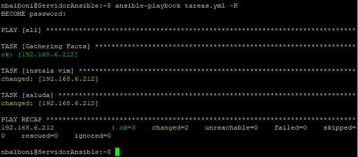
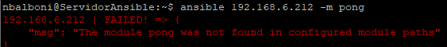
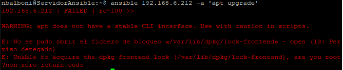
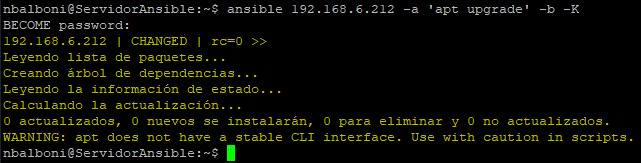
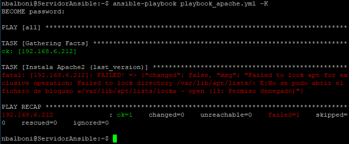
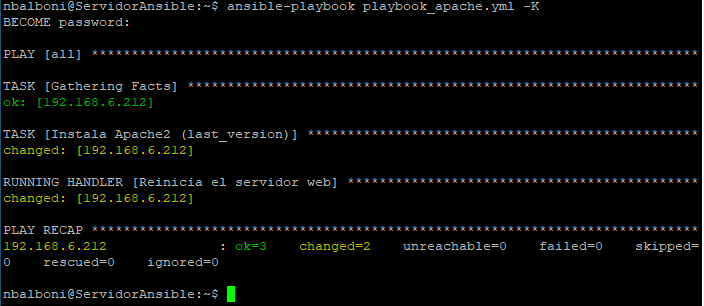
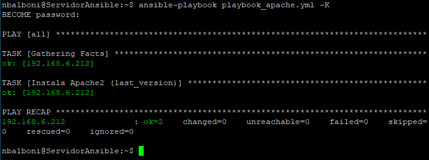

# Guía de instalación y manejo de Ansible

## Prólogo
Ansible es una herramienta de automatización y gestión de la configuración. Con Ansible podremos gestionar decenas, cientos o miles de sistemas de forma sencilla, y además desde cualquier lugar. Su arquitectura basada en módulos permite extender sus capacidades casi de forma indefinida. 

En esta guía técnica aprenderemos a instalar Ansible así como algunos conceptos básicos para su utilización.
***
## Requisitos previos
Ansible tiene únicamente dos dependencias:  
* Librería SSH
* Python 3

Teniendo estas dos dependencias instaladas y un editor de textos (Nano, Vim, VisualStudio,...) ya podemos empezar a utilizar Ansible.  

También es recomendable que tengamos al menos dos máquinas (pueden ser máquinas virtuales) en las que podamos ir probando los diferentes pasos expuestos en esta guía.  
Una máquina actuará de servidor (en ella instalaremos Ansible y almacenaremos los archivos .yml que posteriormente ejecutaremos) y la(s) otra(s) actuarán como "cliente" (estas serán las máquinas administradas. En ellas se ejecutarán las instrucciones que lance el servidor).

Ya que Ansible requiere conectarse vía SSH a las máquinas adminstradas primero debemos asegurarnos de que el servico SSH está funcionando correctamente.  
Para ello lanzaremos el siguiente comando:  

```systemctl status sshd.service```  

Para que no tengamos que introducir la contraseña cada vez que lancemos una orden seguiremos los siguientes pasos:  

* Generar un par de claves pública/privada en nuestro servidor: ```ssh key-gen -t rsa```  
El par de claves se almacenará en **~/.ssh/id_rsa**  
* Exportar las claves a la(s) máquina(s) administradas: ```ssh-copy-id -i ~/.ssh/id_rsa 192.168.6.212```*  
  
    **Nota:** si deseamos copiar la clave a más de una máquina deberemos lanzar el comando completo tantas veces como sea necesario (no se pueden concatenar IPs en un solo comando)  
    \* Esta IP es la que estoy usando yo en mi máquina administrada, deberás sustituirla por la ip correspondiente a tu máquina, que tambien debe tener el servicio ssh instalado y corriendo.  
* Una vez hecho esto solo debemos conectarnos vía SSH para comprobar que, efectivamente, no nos pide contraseña
***
## Instalación
En Debian 11 no es necesario agregar ninguna librería específica para instalar Ansible.  

El instalador de apt trae integrada la instalación de Python 3, por lo que para instalar Ansible en nuestro servidor únicamente es necesario lanzar el siguiente comando:  

```sudo apt install ansible -y```  
***
## Manejo de Ansible
En ansible existen un sinfín de librerías y tareas. No vamos a hablar de todas ellas en esta guía. Se irán detallando en futura documentación conforme sea necesario.  

A continuacón pasaremos a ver determinados conceptos, metodologías de trabajo y comandos esenciales para el uso básico de Ansible.
### <u>Inventory (inventario)</u>  
<br>

Ansible automatiza tareas en nodos administrados o "hosts" en su infraestructura, utilizando una lista o grupo de listas conocido como inventario. 

Se puede pasar nombres de host a traves de comandos, pero la mayoría de los usuarios de Ansible prefieren crear archivos de inventario. 

El inventario define los nodos administrados que automatiza, con grupos para que pueda ejecutar tareas de automatización en múltiples hosts al mismo tiempo.  
Una vez que se define el inventario, utiliza patrones para seleccionar los hosts o grupos en los que desea que se ejecute Ansible.  

El archivo de inventario por defecto se encuentra en **/etc/ansible/host**, lo unico que debemos hacer es editarlo con cualquier editor de texto:  

```sudo nano /etc/ansible/host```  

*Nota: en caso de que la instalación no haya creado el directorio **/etc/ansible** deberemos crearlo nosotros mismos y crear en él el fichero **hosts** (sin extensión).* 

El fichero **hosts** puede contener referencias de nodos administrados de diversas formas.  
* IPs  
  
  ```
  # Los comentarios se escriben precedidos de una almohadilla 

  192.168.6.212
  192.168.6.213
  192.168.6.214
  ```  
* Nombres de dominio  
  
  ```
  host1.midominio.com
  host2.midominio.com
  host3.midominio.com
  ```  
* Expresiones regulares  
  
  ```
  host[1-3].midominio.com 
  192.168.6.2[11-19]
  ```   
  Ansible tambien admite el uso de otras expresiones tales como los comodines (*,^,_), sin embargo no es recomendable su uso ya que puede derivar en conflictos o provocar que apliquemos configuraciones en maquinas indeseadas.
* Grupos  
  
  Ansible permite la integración de todas las formas de referir un host que hemos visto anteriormente en **grupos** administrativos.  

  ```
  [Grupo 1]
  192.168.6.212
  host1.midominio.com

  [Grupo 2]
  host2.midominio.com
  host3.midominio.com
  192.168.6.2[13-19]
  ```  
<br>
Nota: Ansible no reconocerá a aquellos hosts que no figuren en el inventario. Ansible permite el uso de archivos de host diferentes al archivo por defecto. De esta manera podriamos tener archivos diferentes para diferentes proyectos.   

Para ello debemos utilizar la opción -i, quedando un comando con la siguiente sintáxis: ```ansible [ip host] -m [comando] -i [ruta archivo de host]``` 

<br>  
    
### <u>Uso de comandos *ad hoc*</u>  
<br>

Ansible es un lenguaje declarativo, esto es, nosotros como usuarios no lanzamos comandos concretos a los nodos administrados, si no que enviamos tareas que determinan el estao que debe terner la máquina una vez finalizado el *playbook* correspondiente.  

Por ejemplo, si deseamos instalar nginx en los nodos administrados no lanzaremos el comando "apt install nginx" si no que lanzaremos una tarea que, una vez finalizada habrá lanzado todos los comandos necesarios para que nginx esté instalado y actualizado a su última versión.  

Sin embargo Ansible nos permite lanzar comandos  y módulos *ad hoc* si es necesario.  
Si escribimos ```ansible [ip host] -m [módulo]``` podremos lanzar un módulo concreto en la máquina administrada, por ejemplo ping.  

Si deseamos lanzar un comando concreto, por ejemolo ```echo hola``` debemos utilixar la opción ``` -a ``` , resultando en un comando con siguoiente sintaxis:  ```ansible [ip host] -a [comando]``` 

### <u>Correr comandos con permisos de super usuario</u>
<br>

Con Ansible podemos lanzar todo tipo de comandos; algunos de los cuales requeriran permisos de super usuario.
Para ello contamos con uina opcion llamada **become**, que se abrevia en la linea de comandos con la opcion ```-b``` .  
Utilizaremos la opción ```-K``` en MAYÚSCULAS para que nos pida la contraseña, que será la contraseña de super usuario del nodo administrado **(¡¡NO LA DE NUESTRO SERVIDOR!!)**.  

### <u>Redactar un **playbook**</u>
<br>

Un playbook de Ansible es una unidad organizada de scripts que define el trabajo para una configuración de servidor administrada.
Los playbooks de Ansible estan escritos en YAML.  

*YAML es un lenguaje de serialización de datos que se utiliza para representar datos en un formato legible por humanos. Se utiliza comúnmente para configurar aplicaciones y sistemas informáticos.*

*En YAML, los datos se representan utilizando una estructura de clave-valor. Los datos se organizan en una jerarquía de elementos, donde cada elemento puede tener uno o más valores asociados.*  

Un ejemplo de script en YAML sería el siguiente:  

```yaml
---

# Ejemplo de archivo YAML

# Definir los datos del usuario
nombre: Juan
apellido: Perez
edad: 30

# Definir una lista de objetos
productos:
  - nombre: Televisor
    precio: 500
  - nombre: Smartphone
    precio: 300

# Definir un objeto anidado
direccion:
  calle: Av. Libertador
  numero: 1234
  ciudad: Buenos Aires
  ```  

Un ejemplo aplicado a Ansible sería el siguiente:  

```yaml
---

- hosts: all
  tasks:
  - name: instala vim
    apt: name=vim state=present
    become: true
  - name: saluda
    shell: echo hola
```  

Para ejecutar un playbook lanzaremos el comando ```ansible-playbook [ruta del archivo .yml] -K``` .  
Este comando ejecutará el script.  
La opción ```-K``` hace que nos pida la contraseña de superusuario. Esto es necesario en caso de que hayamos incluido la opción **become** en alguna de las tareas de nuestro playbook o en la cabecera del archivo (en cuyo caso se aplicaría a todo el script).  

La salida por defecto mostrará lo siguiente:  

  

En esta salida podemos ver en verde las tareas que se han ejecutado satisfactoriamente sin suponer cambios en la máquina, en amarillo aquellas que se han ejecutado correctamente efectuando cambios en la máquina y en rojo (no ha habido ningun fallo en este ejemplo) aquellas tareas que no han podido ejecutarse. En caso de fallo se nos especificará el motivo de dicho fallo.  
A continuacion simularemos un fallo:  

  
  

En el primer caso podemos apreciar que hemos escrito mal el módulo que deseabamos ejecutar, mientras que en el segundo vemos como el fallo se produce porque hemos intentado ejecutar un comando que requiere permiso de sudo.  

Si volvemos a ejecutar el comando pero esta vez añadimos los parámetros correctos para ejecutarlo como sudo, el comando se ejecutará sin problema.  

  

### <u>Archivos de configuración</u>
<br>

Los archivos de configuración, con extensión ".cfg" son una herramienta fundamental para la personalización de los parámetros por defecto de Ansible.  

Permiten establecer configuraciones específicas de conexión, ejecución y uso de módulos, entre otros aspectos, para adaptar el comportamiento de la herramienta a las necesidades de cada entorno o proyecto.  

Los archivos de configuración se pueden modificar a nivel global, para aplicarlos a toda la instalación de Ansible, o a nivel de proyecto, mediante la inclusión de directivas específicas en los playbooks de Ansible.  

Con esta flexibilidad, los archivos de configuración se convierten en una herramienta poderosa para adaptar Ansible a las necesidades particulares de cada entorno y proyecto.  

Si se desea aplicar una configuración a nivel global el archivo de configuraion se ubicará en la ruta **/etc/ansible/ansible.cfg**.

Si por el contrario se desea aplicar configuraciones a nivel de usuario (lo cual puede ser muy util si hay trabajando varios administradores en el mismo servidor, diferentes proyectos, etc) al archivo se puede alojar en el directorio en el que estemos trabajando en ese momento o en el directorio "home" del usuario en cuestión (o en la ruta especificada en la variable de entorno **ANSIBLE_CONFIG**).  

A continuación podras encontrar un enlace que te llevará a una guia para poder redactar los archivos de configuración:  

https://docs.ansible.com/ansible/latest/reference_appendices/config.html#the-configuration-file  

### <u>Handlers (manejadores)</u>
<br>

A veces querremos que algunas configuraciones se ejecuten únicamente despues de que sucedan determinados eventos. Para ello hacemos uso de los **handlers**.  

En Ansible, un handler es una tarea especial que se ejecuta sólo cuando se produce un cambio en el estado de un recurso que es manejado por una tarea previa. En otras palabras, un handler es una tarea que se ejecuta como respuesta a un evento específico, como una actualización o un reinicio de un servicio.  

Los handlers son útiles para realizar acciones que deben ser tomadas después de que se hayan realizado ciertos cambios en el estado de un recurso. Por ejemplo, si se actualiza la configuración de un servicio, es posible que sea necesario reiniciarlo para que los cambios surtan efecto. En este caso, se podría utilizar un handler para reiniciar el servicio sólo si se han realizado cambios en su configuración.  

Los handlers se definen en el archivo de tareas de Ansible (playbook) y se llaman utilizando el módulo "notify". El módulo "notify" se utiliza para notificar a Ansible de que se debe ejecutar un handler después de que se haya realizado un cambio en el estado de un recurso.  

A continuación veremos un ejemplo:  

```yaml
---

- hosts: all
  tasks: 
    - name: Instala Apache2 (last_version)
      apt: name=apache2 state=present update_cache=true
      notify: #Esta instancia permite llamar a tantos handlers como deseemos
        - "Reinicia el servidor web"
  handlers: #A partir de aquí podemos incluir tantos handlers como deseemos
    - name: Reinicia el servidor web
      service: name=apache2 state=restarted
```  

Las posiblilidades que esto abre a la hora de administrar nodos de una red son practicamente infinitas. Además, la de Ansible es una comunidad activa que constantemente está aportanfo nuevos módulos, ideas y trabajos que pueden sernos de gran utilidad. 

Aquí podemos observar que da fallo al no haber incluido la clausula **become** y haber intentado lanzar una tarea que requiere permisos de super usuario:  

  

Simplemente añadiendo la clausula become en el nivel de indentación correcto el problema se soluciona.

```yaml
---

- hosts: all
  become: true
  tasks: 
    - name: Instala Apache2 (last_version)
      apt: name=apache2 state=present update_cache=true
      notify: #Esta instancia permite llamar a tantos handlers como deseemos
        - "Reinicia el servidor web"
  handlers: #A partir de aquí podemos incluir tantos handlers como deseemos
    - name: Reinicia el servidor web
      service: name=apache2 state=restarted
```  

  

Si volvemos a lanzar el playbook, al no producirse ningún cambio, ya que Apache ya se encuentra instalado, no lanza la tarea de reinicar el servidor web.  

  

Si hubiesemos creado esta tarea como una task más en lugar de como un handler la tarea se hubiese ejecutado igualmente.  

---
## Epílogo
En conclusión, Ansible es una herramienta de automatización de TI de código abierto que simplifica la gestión de configuración, la implementación de aplicaciones y el mantenimiento de infraestructuras de TI. Con Ansible, los administradores de sistemas pueden automatizar tareas repetitivas y complejas, ahorrando tiempo y reduciendo errores.

En esta guía técnica, se han cubierto los conceptos básicos de Ansible, incluyendo la instalación y configuración, la creación de playbooks y roles, y la gestión de inventarios.  

Ansible es una herramienta poderosa y versátil que puede simplificar y acelerar la gestión de infraestructuras de TI. 

Con un poco de práctica y experimentación, los administradores de sistemas pueden utilizar Ansible para automatizar tareas complejas y mejorar la eficiencia de sus operaciones diarias.  

Espero que esta guía te resulte de utilidad.